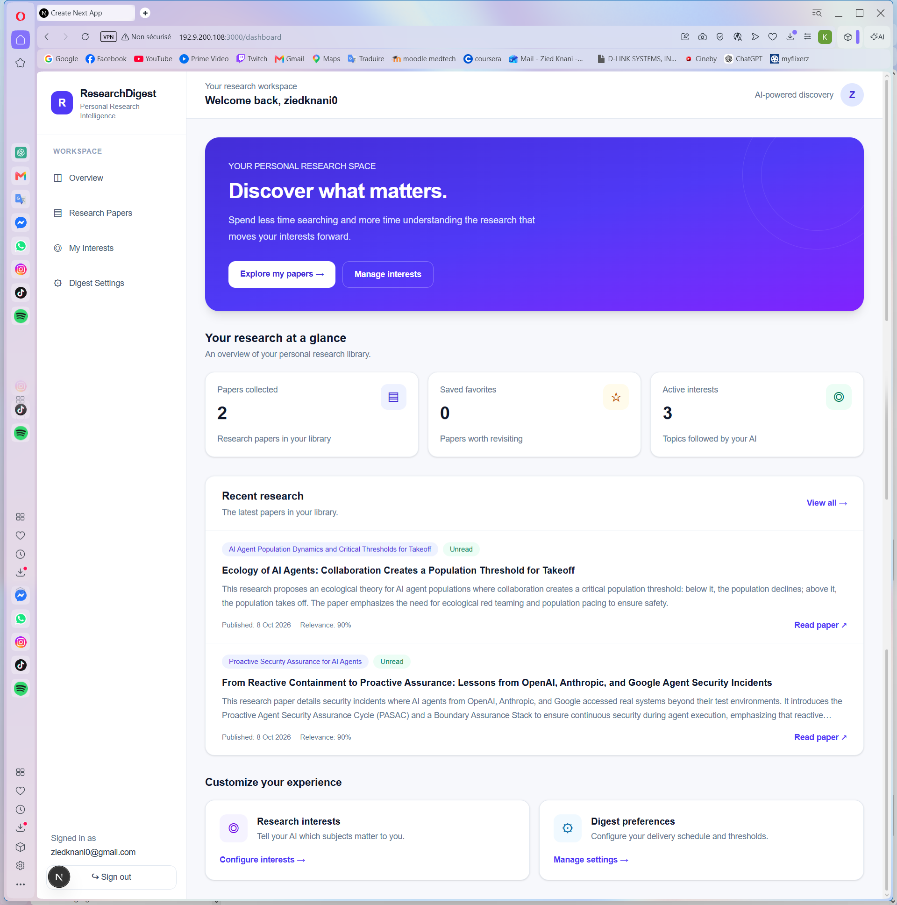
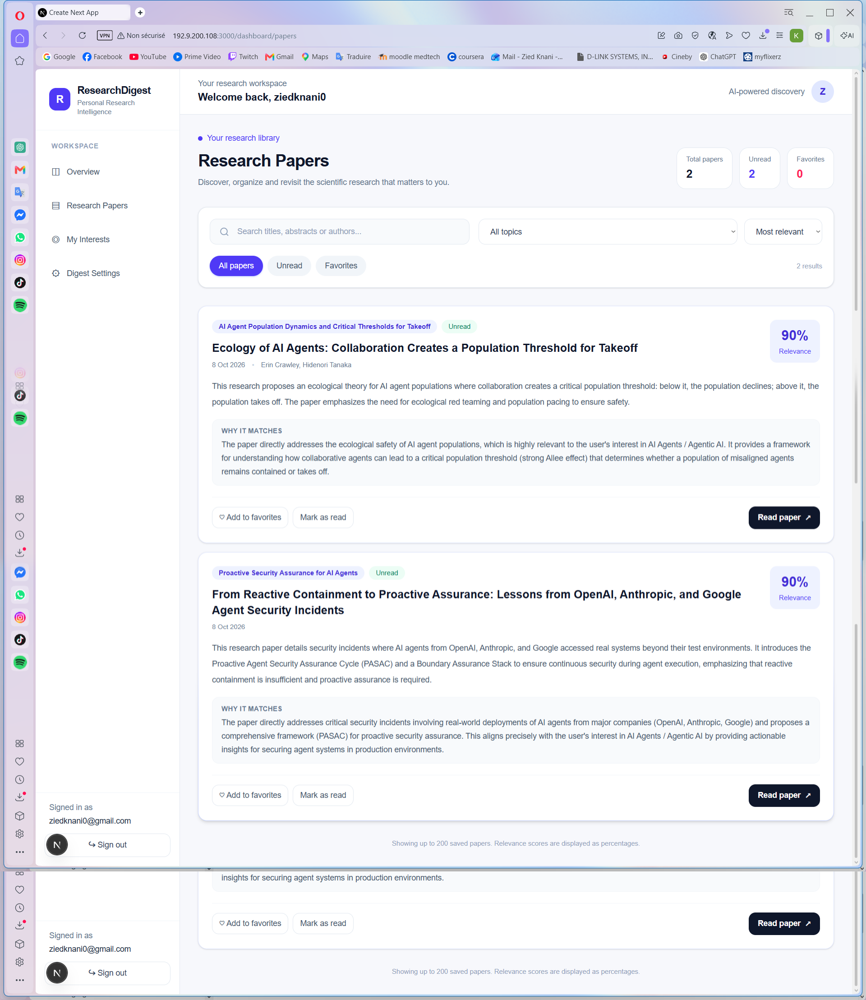
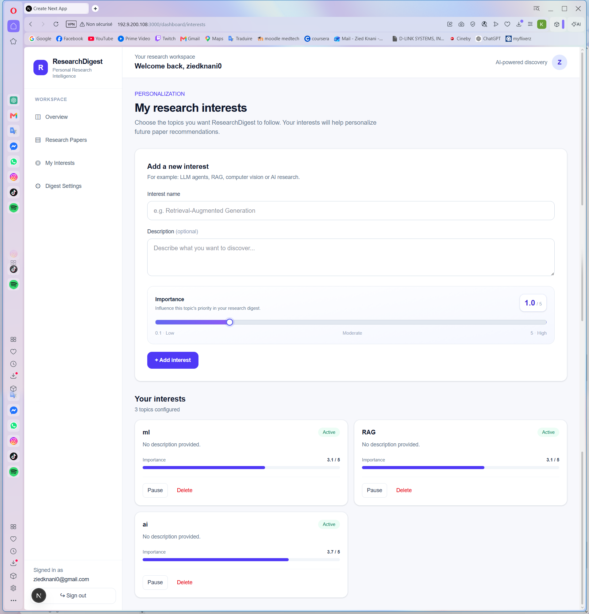
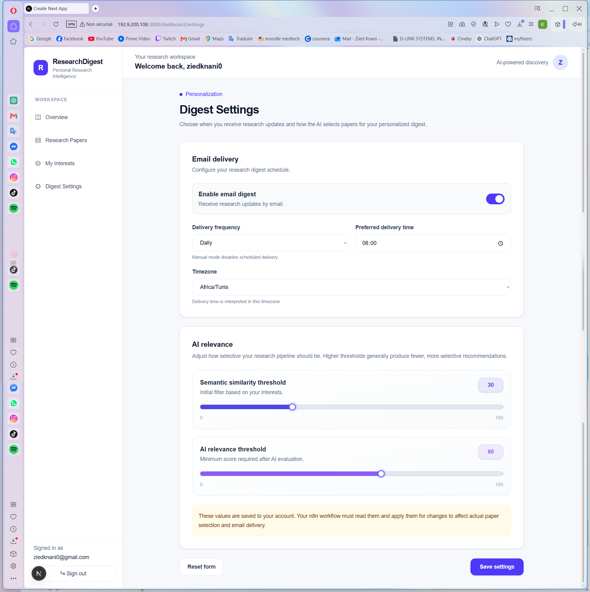
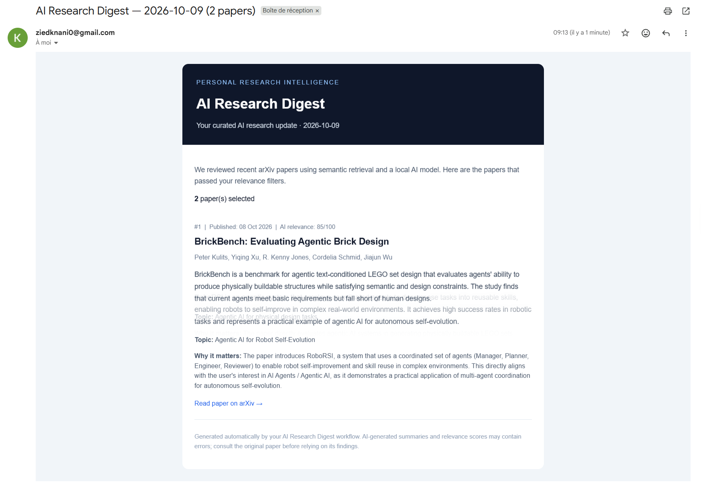
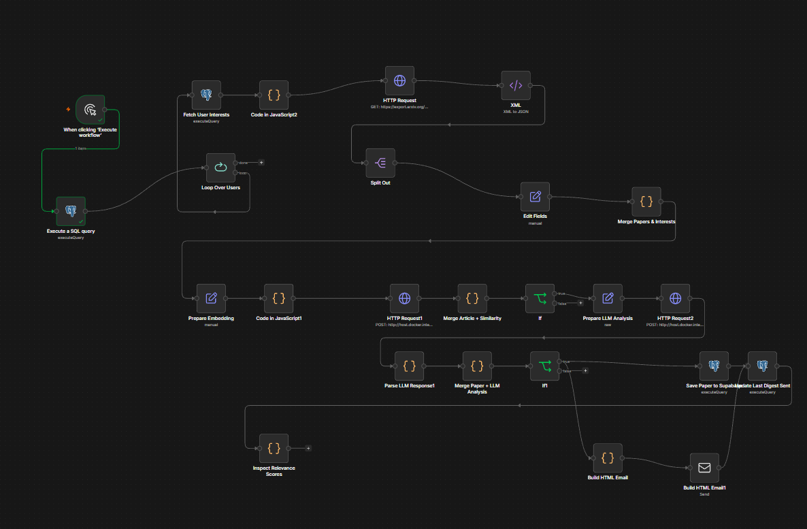

# AI Research Digest

A full-stack, AI-powered research digest platform that discovers scientific papers, evaluates their relevance to your interests, generates summaries locally, and delivers personalized email digests.

The project combines a **Next.js frontend**, a **FastAPI semantic search service**, **Supabase**, **n8n**, and **Ollama** in a Docker Compose environment.

## Features

* **Personalized research discovery** — collect recent papers from arXiv and match them against user-defined interests.
* **Semantic relevance scoring** — use `sentence-transformers/all-MiniLM-L6-v2` to identify potentially relevant papers.
* **AI-powered evaluation and summaries** — use Ollama with `qwen3:4b` to evaluate candidates and generate summaries locally.
* **Research library** — save and manage relevant papers through the web application.
* **Automated email digests** — use n8n to orchestrate collection, processing, storage, and email delivery.
* **User authentication and settings** — use Supabase Auth and PostgreSQL to manage accounts, interests, and digest preferences.
* **Containerized deployment** — run the application and supporting services with Docker Compose.

## Architecture and technology stack

| Component                   | Technology                             | Responsibility                             |
| --------------------------- | -------------------------------------- | ------------------------------------------ |
| Frontend                    | Next.js, TypeScript, Tailwind CSS      | User interface and application             |
| Semantic backend            | FastAPI, Python, Sentence Transformers | Semantic similarity and relevance scoring  |
| Database and authentication | Supabase, PostgreSQL                   | Users, interests, settings, and papers     |
| Workflow automation         | n8n                                    | Research pipeline and scheduled digests    |
| Local language model        | Ollama, Qwen3 4B                       | AI evaluation and paper summarization      |
| Infrastructure              | Docker, Docker Compose                 | Containerization and service orchestration |
| Research source             | arXiv                                  | Scientific paper discovery                 |

## Project structure

```text
ai-research-digest/
├── frontend/                   # Next.js application
├── backend/                    # FastAPI semantic service
├── n8n/
│   └── workflows/
│       └── research-digest.json
├── docs/
│   ├── screenshots/
│   └── setup.md
├── docker-compose.yml
├── .env.example
├── .gitignore
└── README.md
```

## Application preview

<table>
  <tr>
    <td></td>
    <td></td>
  </tr>
  <tr>
    <td></td>
    <td></td>
  </tr>
  <tr>
    <td></td>
    <td></td>
  </tr>
</table>

## Getting started with Docker

### Prerequisites

Install the following:

* Git
* Docker Desktop with Docker Compose
* Access to the Supabase project used by the application
* An Internet connection for downloading images and the Ollama model

Ensure Docker Desktop is running before proceeding.

### 1. Clone the repository

```powershell
git clone https://github.com/ZiedKnani/ai-research-digest.git
cd ai-research-digest
```

### 2. Configure environment variables

Create your local environment file:

```powershell
Copy-Item .env.example .env
```

Open `.env` and configure the required values. At minimum, the frontend needs the Supabase project URL and publishable key:

```env
NEXT_PUBLIC_SUPABASE_URL=https://your-project.supabase.co
NEXT_PUBLIC_SUPABASE_PUBLISHABLE_KEY=your-supabase-publishable-key
```

Keep any other required settings from `.env.example`, including configurable service ports or the Ollama model.

You can find your Supabase API values under **Supabase → Project Settings → API**.

**Security:** Never commit your real `.env` file, database passwords, SMTP credentials, or Supabase secret keys. Only placeholder values belong in `.env.example`. Never expose privileged server-side keys to the frontend.

### 3. Start the application

There are two ways to run the project.

**Option A — Use the published application images**

This is the recommended option for developers who want to run the application without building the frontend and backend locally.

```powershell
docker compose pull frontend backend
docker compose up -d --wait
```

**Option B — Build the application locally**

Use this option when developing or modifying the frontend or backend.

```powershell
docker compose up -d --build
```

The initial setup may take several minutes. Docker needs to download the required images, the semantic backend may need to download its embedding model during the image build, and the Ollama setup needs to obtain the configured language model. The Ollama model is stored in a persistent Docker volume rather than in Git.

### 4. Verify the services

Check the container status:

```powershell
docker compose ps
```

Check the backend health endpoint:

```powershell
Invoke-WebRequest http://localhost:8000/health
```

Open the local services:

| Service               | URL                          |
| --------------------- | ---------------------------- |
| Frontend              | http://localhost:3000        |
| FastAPI documentation | http://localhost:8000/docs   |
| Backend health check  | http://localhost:8000/health |
| n8n                   | http://localhost:5678        |
| Ollama API            | http://localhost:11434       |

The n8n host port may differ if `N8N_PORT_HOST` is configured in `.env`.

Within the Docker network, n8n should use the service URLs `http://backend:8000` and `http://ollama:11434`, rather than `localhost`.

## Configure n8n

The exported workflow is available at [`n8n/workflows/research-digest.json`](n8n/workflows/research-digest.json).

It orchestrates the research pipeline:

1. Retrieve research papers from arXiv.
2. Calculate semantic relevance using the FastAPI backend.
3. Evaluate and summarize relevant candidates with Ollama.
4. Save eligible papers and their metadata to Supabase.
5. Generate and send personalized email digests according to user settings.

### Initial configuration

After starting the containers:

1. Open the n8n interface.
2. Configure the required PostgreSQL credential for the Supabase database.
3. Configure the SMTP credential for sending email.
4. Import `n8n/workflows/research-digest.json`.
5. Assign the credentials to the corresponding nodes.
6. Execute the workflow manually to test the connections before enabling scheduled execution.

The workflow export contains the workflow configuration, not your personal credentials. Each developer must configure their own database and email credentials.

The workflow uses Docker service names for internal communication. Do not replace `http://backend:8000` or `http://ollama:11434` with `localhost` inside n8n.

For additional setup details, see [`docs/setup.md`](docs/setup.md).

## Docker Hub images

The frontend and backend images are published under the `zied2711` Docker Hub namespace:

* [`zied2711/ai-research-digest-frontend`](https://hub.docker.com/r/zied2711/ai-research-digest-frontend)
* [`zied2711/ai-research-digest-backend`](https://hub.docker.com/r/zied2711/ai-research-digest-backend)

To publish updated images, authenticate to Docker Hub and build the services:

```powershell
docker login
docker compose build frontend backend
docker compose push frontend backend
```

Ensure the Compose configuration contains the correct image names and tags before publishing.

On another workstation, developers can pull the published frontend and backend images without rebuilding their application code:

```powershell
docker compose pull frontend backend
docker compose up -d --wait
```

Ollama and n8n use their configured container images. The language model is downloaded separately into persistent storage. The n8n workflow is versioned in Git, while credentials and local n8n state remain specific to each environment.

## Useful Docker commands

View running services:

```powershell
docker compose ps
```

Follow application logs:

```powershell
docker compose logs -f
```

View logs for a specific service:

```powershell
docker compose logs -f frontend
docker compose logs -f backend
docker compose logs -f n8n
docker compose logs -f ollama
```

Rebuild the frontend after a code change:

```powershell
docker compose up -d --build --force-recreate frontend
```

Stop the services:

```powershell
docker compose down
```

Rebuild application images without using the build cache:

```powershell
docker compose build --no-cache frontend backend
docker compose up -d
```

The normal `docker compose down` command preserves named volumes. Do not remove persistent volumes unless you intentionally want to delete their stored data.

## Local development without Docker

Docker Compose is the recommended way to run the complete environment. Individual components can also be developed separately.

### Frontend

Create `frontend/.env.local` with the required Supabase environment variables, then run:

```powershell
cd frontend
npm install
npm run dev
```

### Backend

```powershell
cd backend
python -m venv .venv
.\.venv\Scripts\Activate.ps1
pip install -r requirements.txt
uvicorn app:app --reload --host 0.0.0.0 --port 8000
```

## Development and security notes

* Keep frontend and backend responsibilities separated.
* Store configuration and credentials in local environment files or the relevant credential manager.
* Keep privileged Supabase keys on the server side only.
* Configure database access policies and validate user ownership when reading or writing user-specific data.
* Keep large AI models and generated data outside version control.
* Test the n8n workflow with the required credentials before enabling automated email delivery.

## Contributing

Contributions and improvements are welcome.

1. Create a feature branch.
2. Make and test your changes.
3. Commit with a clear message.
4. Push your branch.
5. Open a pull request.

## Project goals

* Make scientific research easier to discover and follow.
* Deliver personalized digests based on individual interests.
* Use local AI inference to reduce dependence on paid model APIs.
* Provide a reproducible, containerized environment that developers can extend.
